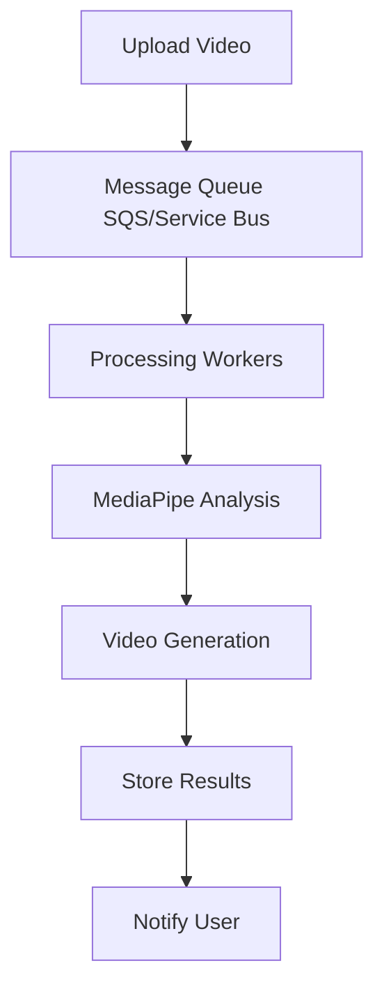

# Commercial Deployment Plan
## Basketball Shot Analysis Service

### Executive Summary
The Basketball Shot Analysis Service is a production-ready computer vision application that provides real-time biomechanical analysis of basketball shooting form using MediaPipe pose estimation and advanced video processing.

---

## 1. Market Analysis & Business Model

### Target Markets
- **Primary**: Youth basketball training facilities and coaches
- **Secondary**: Individual players and personal trainers
- **Tertiary**: Professional teams and sports academies

### Revenue Streams
1. **SaaS Subscription Model**
   - Basic Plan: $29/month (10 analyses)
   - Pro Plan: $99/month (100 analyses + detailed reports)
   - Enterprise: $299/month (unlimited + API access)

2. **Pay-Per-Analysis**
   - Single analysis: $4.99
   - Bulk packages: 10 for $39.99

3. **White-Label Licensing**
   - Custom branding for training facilities
   - Revenue sharing model

---

## 2. Technical Architecture for Scale

### Cloud Infrastructure (AWS/Azure/GCP)

#### Compute Services
- **Container Orchestration**: Kubernetes (EKS/AKS/GKE)
- **Auto-scaling**: HPA based on CPU/memory and queue depth
- **Load Balancing**: Application Load Balancer with health checks

#### Storage Strategy
```yaml
Video Storage:
  - Input Videos: S3/Blob Storage (Standard tier)
  - Processed Videos: S3/Blob Storage (Intelligent tiering)
  - Temporary Processing: SSD persistent volumes
  - Retention Policy: 90 days for free users, 1 year for paid

Database:
  - Primary: PostgreSQL (RDS/Azure Database)
  - Cache: Redis (ElastiCache/Azure Cache)
  - Analytics: ClickHouse or BigQuery
```

#### Processing Pipeline


### Performance Requirements
- **Video Processing**: 30-second videos processed in < 2 minutes
- **Concurrent Users**: Support 1000+ simultaneous uploads
- **API Response Time**: < 200ms for status checks
- **Uptime SLA**: 99.9% availability

---

## 3. Deployment Environments

### Development Environment
- **Local Development**: Docker Compose setup
- **CI/CD**: GitHub Actions with automated testing
- **Testing**: Pytest with video fixtures and mock data

### Staging Environment
- **Infrastructure**: Scaled-down production replica
- **Purpose**: Integration testing and client demos
- **Data**: Anonymized production data subset

### Production Environment
- **Multi-Region**: Primary + DR region
- **Monitoring**: Prometheus + Grafana + AlertManager
- **Logging**: ELK Stack or Azure Monitor

---

## 4. Security & Compliance

### Data Protection
- **Encryption**: AES-256 at rest, TLS 1.3 in transit
- **Privacy**: GDPR/CCPA compliant data handling
- **Video Storage**: Client videos auto-deleted after retention period
- **Access Control**: Role-based authentication (RBAC)

### Security Measures
```yaml
Authentication:
  - OAuth 2.0 with JWT tokens
  - Multi-factor authentication
  - API rate limiting

Infrastructure:
  - WAF protection
  - DDoS mitigation
  - VPC/VNet isolation
  - Regular security audits
```

---

## 5. Scalability Strategy

### Horizontal Scaling
- **Microservices Architecture**: Separate video processing, analysis, and web services
- **Queue-Based Processing**: Async video analysis with Redis/SQS
- **CDN Integration**: CloudFront/Azure CDN for video delivery

### Auto-Scaling Configuration
```yaml
Metrics:
  - CPU utilization > 70%
  - Memory usage > 80%
  - Queue depth > 50 jobs
  - Response time > 500ms

Scaling Rules:
  - Scale out: Add 2 instances
  - Scale in: Remove 1 instance
  - Cool-down: 5 minutes
  - Max instances: 50
```

---

## 6. Monitoring & Analytics

### Application Monitoring
- **Health Checks**: /health endpoint for each service
- **Metrics**: Processing time, success rate, error counts
- **Alerts**: Slack/PagerDuty integration
- **Dashboards**: Real-time operational metrics

### Business Analytics
```sql
-- Key Performance Indicators
SELECT 
    COUNT(*) as total_analyses,
    AVG(processing_time) as avg_processing_time,
    COUNT(DISTINCT user_id) as active_users,
    SUM(CASE WHEN subscription_type = 'paid' THEN 1 ELSE 0 END) as paid_users
FROM analysis_jobs 
WHERE created_at >= NOW() - INTERVAL '30 days';
```

---

## 7. Cost Optimization

### Infrastructure Costs (Monthly Estimates)
```yaml
Compute:
  - Kubernetes cluster: $500-2000
  - Auto-scaling workers: $1000-5000
  - Load balancers: $100-300

Storage:
  - Video storage (1TB): $200-400
  - Database: $300-800
  - Backup storage: $100-200

Networking:
  - Data transfer: $200-1000
  - CDN: $100-500

Total: $2,400-10,200/month
```

### Cost Optimization Strategies
- **Spot Instances**: Use for batch processing (60% cost reduction)
- **Storage Lifecycle**: Auto-archive old videos to cheaper tiers
- **Compression**: Optimize video encoding for storage efficiency
- **Regional Deployment**: Deploy closer to user base

---

## 8. Go-to-Market Strategy

### Phase 1: MVP Launch (Months 1-3)
- **Target**: 100 beta users
- **Features**: Core video analysis, web interface
- **Pricing**: Free beta with usage limits
- **Marketing**: Basketball coaching communities, social media

### Phase 2: Commercial Launch (Months 4-6)
- **Target**: 1,000 paying users
- **Features**: Mobile app, detailed reports, comparisons
- **Pricing**: Full pricing tiers active
- **Marketing**: Partnerships with training facilities

### Phase 3: Scale (Months 7-12)
- **Target**: 10,000 users, enterprise clients
- **Features**: API access, white-label solutions
- **Expansion**: International markets, multiple sports

---

## 9. Technical Implementation Plan

### Phase 1: Infrastructure Setup
```bash
# 1. Container Registry Setup
docker build -t basketball-analysis:latest .
docker tag basketball-analysis:latest your-registry/basketball-analysis:v1.0.0
docker push your-registry/basketball-analysis:v1.0.0

# 2. Kubernetes Deployment
kubectl apply -f k8s/namespace.yaml
kubectl apply -f k8s/configmap.yaml
kubectl apply -f k8s/secrets.yaml
kubectl apply -f k8s/deployment.yaml
kubectl apply -f k8s/service.yaml
kubectl apply -f k8s/ingress.yaml

# 3. Database Migration
python manage.py migrate
python manage.py create-admin
```

### Phase 2: CI/CD Pipeline
```yaml
# .github/workflows/deploy.yml
name: Deploy to Production
on:
  push:
    branches: [main]
jobs:
  test:
    runs-on: ubuntu-latest
    steps:
      - uses: actions/checkout@v2
      - name: Run Tests
        run: pytest tests/
  
  deploy:
    needs: test
    runs-on: ubuntu-latest
    steps:
      - name: Deploy to Kubernetes
        run: kubectl apply -f k8s/
```

---

## 10. Risk Management

### Technical Risks
- **Processing Bottlenecks**: Queue monitoring and auto-scaling
- **Storage Costs**: Automated cleanup and compression
- **API Rate Limits**: Circuit breakers and retry logic

### Business Risks
- **Competition**: Focus on accuracy and user experience
- **Market Adoption**: Freemium model to reduce barriers
- **Seasonal Demand**: Basketball season planning and capacity

### Mitigation Strategies
- **Multi-cloud**: Avoid vendor lock-in
- **Feature Flags**: Safe deployment of new features
- **A/B Testing**: Validate changes before full rollout

---

## 11. Success Metrics

### Technical KPIs
- **Uptime**: 99.9%+ availability
- **Performance**: <2 min processing time
- **Accuracy**: >95% pose detection accuracy
- **Scalability**: Handle 10x traffic spikes

### Business KPIs
- **User Growth**: 20% month-over-month
- **Conversion Rate**: 15% free-to-paid
- **Churn Rate**: <5% monthly
- **Revenue**: $100K ARR by end of year 1

---

## 12. Next Steps

### Immediate Actions (Next 30 days)
1. Set up cloud infrastructure and CI/CD
2. Implement user authentication and billing
3. Create landing page and marketing materials
4. Begin beta user recruitment

### Medium-term (3-6 months)
1. Launch mobile application
2. Implement enterprise features
3. Establish partnership channels
4. International expansion planning

### Long-term (6-12 months)
1. Multi-sport expansion
2. AI model improvements
3. White-label platform
4. Potential acquisition discussions

---

**Document Version**: 1.0  
**Last Updated**: July 22, 2025  
**Next Review**: August 22, 2025
